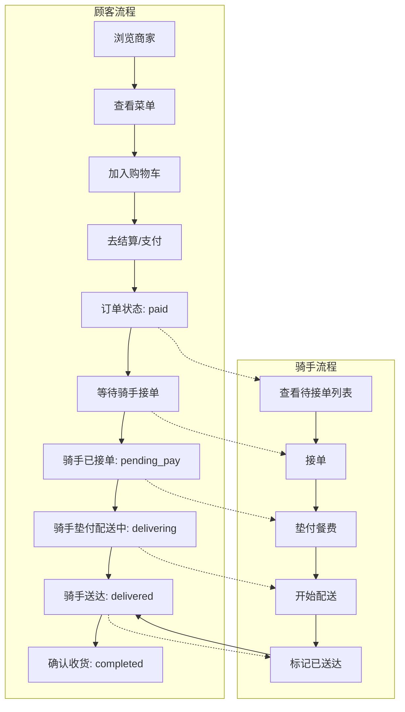

# 校园外跑 — 后端设计方案

## 1. 技术栈推荐

| 层 | 推荐技术 | 说明 |
|---|---------|------|
| 语言 | Java 17+ / Node.js | 二选一 |
| 框架 | Spring Boot 3.x / Egg.js | 按团队熟悉度选择 |
| 数据库 | MySQL 8.0 | 核心数据存储 |
| 缓存 | Redis | 购物车、会话管理 |
| ORM | MyBatis-Plus / Prisma | 数据访问 |
| 认证 | JWT | 无状态 Token 认证 |
| 接口风格 | RESTful JSON | 与前端 http.js 对接 |

> 当前前端 `http.js` 的 `baseURL` 为 `http://localhost:8081`，后端服务可部署在此端口。

---

## 2. 数据库设计

### 2.1 用户表 `users`

| 字段 | 类型 | 说明 |
|------|------|------|
| id | BIGINT PK | 用户ID |
| openid | VARCHAR(64) UNIQUE | 微信 openid |
| name | VARCHAR(50) | 昵称 |
| avatar | VARCHAR(255) | 头像URL |
| phone | VARCHAR(20) | 手机号 |
| role | ENUM('customer','rider') | 角色 |
| token | VARCHAR(255) | JWT token（冗余） |
| created_at | DATETIME | 创建时间 |

### 2.2 商家表 `shops`

| 字段 | 类型 | 说明 |
|------|------|------|
| id | BIGINT PK | 商家ID |
| name | VARCHAR(100) | 名称 |
| tags | VARCHAR(255) | 标签（逗号分隔） |
| rating | DECIMAL(3,2) | 评分 |
| sales | INT | 月销量 |
| delivery | VARCHAR(20) | 配送费描述 |
| min_order | DECIMAL(10,2) | 起送价 |
| logo | VARCHAR(10) | emoji logo |
| created_at | DATETIME | 创建时间 |

### 2.3 菜品表 `foods`

| 字段 | 类型 | 说明 |
|------|------|------|
| id | BIGINT PK | 菜品ID |
| shop_id | BIGINT FK | 所属商家 |
| name | VARCHAR(100) | 菜品名 |
| description | VARCHAR(255) | 描述 |
| price | DECIMAL(10,2) | 单价 |
| created_at | DATETIME | 创建时间 |

### 2.4 购物车表 `cart_items`

| 字段 | 类型 | 说明 |
|------|------|------|
| id | BIGINT PK | 主键 |
| user_id | BIGINT FK | 用户ID |
| shop_id | BIGINT FK | 商家ID |
| food_id | BIGINT FK | 菜品ID |
| food_name | VARCHAR(100) | 菜品名（冗余） |
| price | DECIMAL(10,2) | 单价（冗余） |
| qty | INT | 数量 |
| created_at | DATETIME | 创建时间 |

### 2.5 订单表 `orders`

| 字段 | 类型 | 说明 |
|------|------|------|
| id | BIGINT PK | 订单ID |
| user_id | BIGINT FK | 顾客ID |
| shop_id | BIGINT FK | 商家ID |
| shop_name | VARCHAR(100) | 商家名（冗余） |
| total | DECIMAL(10,2) | 总金额 |
| status | ENUM | 见下方状态流转 |
| rider_id | BIGINT FK NULL | 骑手ID |
| rider_name | VARCHAR(50) NULL | 骑手名 |
| delivery_addr | VARCHAR(255) | 配送地址 |
| created_at | DATETIME | 创建时间 |

**状态流转**：
```
paid → pending_pay → delivering → delivered → completed
```
- `paid`: 已支付（待接单）
- `pending_pay`: 骑手已接单（待垫付）
- `delivering`: 配送中
- `delivered`: 已送达（待确认）
- `completed`: 已完成

### 2.6 订单明细表 `order_items`

| 字段 | 类型 | 说明 |
|------|------|------|
| id | BIGINT PK | 主键 |
| order_id | BIGINT FK | 订单ID |
| food_name | VARCHAR(100) | 菜品名 |
| price | DECIMAL(10,2) | 单价 |
| qty | INT | 数量 |

### 2.7 骑手账户表 `rider_accounts`

| 字段 | 类型 | 说明 |
|------|------|------|
| id | BIGINT PK | 主键 |
| rider_id | BIGINT FK UNIQUE | 骑手用户ID |
| earnings | DECIMAL(12,2) | 已结算配送费 |
| advanced_total | DECIMAL(12,2) | 当前垫付中总额 |
| completed_count | INT | 完成订单数 |
| updated_at | DATETIME | 更新时间 |

### 2.8 消息通知表 `notifications`

| 字段 | 类型 | 说明 |
|------|------|------|
| id | BIGINT PK | 消息ID |
| user_id | BIGINT FK | 接收用户ID |
| title | VARCHAR(100) | 标题 |
| body | TEXT | 内容 |
| is_read | TINYINT(1) | 是否已读 |
| created_at | DATETIME | 创建时间 |

### 2.9 地址表 `addresses`

| 字段 | 类型 | 说明 |
|------|------|------|
| id | BIGINT PK | 地址ID |
| user_id | BIGINT FK | 用户ID |
| consignee | VARCHAR(50) | 收货人 |
| phone | VARCHAR(20) | 电话 |
| full_address | VARCHAR(255) | 完整地址 |
| is_default | TINYINT(1) | 是否默认 |
| created_at | DATETIME | 创建时间 |

---

## 3. API 接口设计

> 基础路径：`http://localhost:8081`

### 3.1 用户模块 `/user/user`

| 方法 | 路径 | 说明 | 前端对应 |
|------|------|------|---------|
| POST | `/user/user/login` | 微信登录 | `loginAPI(code)` — 返回 token + 用户信息 |
| GET | `/user/user/{id}` | 获取用户信息 | `getUserAPI(id)` |
| PUT | `/user/user` | 更新用户信息 | `updateUserAPI(data)` |

**登录接口返回示例**：
```json
{
  "code": 200,
  "data": {
    "id": 1,
    "name": "林小明",
    "avatar": "",
    "phone": "138****1234",
    "role": "customer",
    "token": "eyJhbGciOiJIUzI1NiIs..."
  }
}
```

### 3.2 商家模块 `/shop`

| 方法 | 路径 | 说明 | 前端对应 |
|------|------|------|---------|
| GET | `/shop/list` | 获取所有商家列表 | 替代 `store.SHOPS` |
| GET | `/shop/{id}/menu` | 获取商家菜品 | 替代 `store.MENUS[id]` |
| GET | `/shop/{id}` | 获取商家详情 | 替代 `store.findShop()` |

### 3.3 购物车模块 `/cart`

| 方法 | 路径 | 说明 | 前端对应 |
|------|------|------|---------|
| GET | `/cart/list` | 获取购物车列表 | 替代 `store.cart` |
| POST | `/cart/add` | 添加商品 | 替代 `store.addToCart()` |
| POST | `/cart/remove` | 减少或删除商品 | 替代 `store.removeFromCart()` |
| GET | `/cart/count` | 获取购物车数量 | 替代 `store.cartCount` |
| DELETE | `/cart/clear` | 清空购物车 | 替代 `store.clearCart()` |

### 3.4 订单模块 `/user/order`

| 方法 | 路径 | 说明 | 前端对应 |
|------|------|------|---------|
| POST | `/user/order/submit` | 提交订单 | 替代 `store.submitOrder()` |
| GET | `/user/order/orderDetail/{id}` | 订单详情 | 替代从 `store.orders` 查找 |
| GET | `/user/order/historyOrders` | 订单列表 | 替代 `store.orders` |
| POST | `/user/order/{id}/confirm` | 确认收货 | 替代 `store.confirmOrder()` |

### 3.5 骑手模块 `/rider`

| 方法 | 路径 | 说明 | 前端对应 |
|------|------|------|---------|
| GET | `/rider/orders/pending` | 待接单列表（status=paid） | 替代 `paidOrders` |
| GET | `/rider/orders/active` | 配送中列表（status=delivering） | 替代 `deliveringOrders` |
| POST | `/rider/order/{id}/accept` | 接单 | 替代 `store.acceptOrder()` |
| POST | `/rider/order/{id}/pay` | 垫付并开始配送 | 替代 `store.payAndDeliver()` |
| POST | `/rider/order/{id}/delivered` | 标记已送达 | 替代 `store.markDelivered()` |
| GET | `/rider/stats` | 骑手统计数据 | 替代 `riderEarnings` + `riderAdvancedTotal` |

### 3.6 消息模块 `/message`

| 方法 | 路径 | 说明 | 前端对应 |
|------|------|------|---------|
| GET | `/message/list` | 获取消息列表 | 替代 `store.messages` |
| PUT | `/message/{id}/read` | 标记已读 | 替代 `store.markMessageRead()` |

### 3.7 地址模块 `/user/address`

| 方法 | 路径 | 说明 | 前端对应 |
|------|------|------|---------|
| GET | `/user/address/list` | 地址列表 | 现有 API |
| POST | `/user/address` | 新增地址 | 现有 API |
| PUT | `/user/address` | 更新地址 | 现有 API |
| DELETE | `/user/address/{id}` | 删除地址 | 现有 API |

---

## 4. 核心业务流程图



## 5. 订单状态机

```
                    acceptOrder()        payAndDeliver()       markDelivered()      confirmOrder()
 paid ──────────────────► pending_pay ─────────────► delivering ──────────► delivered ───────────► completed
(待接单)                (骑手已接单/待垫付)        (配送中)              (已送达/待确认)          (已完成)
```

## 6. 前端接入计划

### 步骤 1：改造 stores

将 Pinia store 中的 mock 数据逻辑替换为 API 调用：

**`stores/user.js`** — 添加 API 调用方法：
- `login(code)` → 调用 `loginAPI(code)`
- `fetchProfile()` → 调用 `getUserAPI(id)`

**`stores/campus.js`** — 将 actions 改为异步 API 调用：
- `fetchShops()` → GET /shop/list
- `fetchMenu(shopId)` → GET /shop/{id}/menu
- `addToCart()` → POST /cart/add
- `removeFromCart()` → POST /cart/remove
- `submitOrder()` → POST /user/order/submit
- `fetchOrders()` → GET /user/order/historyOrders
- `acceptOrder()` → POST /rider/order/{id}/accept
- `payAndDeliver()` → POST /rider/order/{id}/pay
- `markDelivered()` → POST /rider/order/{id}/delivered
- `confirmOrder()` → POST /user/order/{id}/confirm
- `fetchMessages()` → GET /message/list
- `fetchRiderStats()` → GET /rider/stats

### 步骤 2：改造 pages

页面逻辑基本不变，因为 store 的 action 方法签名保持不变，只是内部实现从操作内存数据改为调用 API。

### 步骤 3：注册 API 模块

在 `main.js` 或 `App.vue` 的 `onLaunch` 中引入 API 模块，触发 `http.js` 中拦截器的注册。

---

## 7. 后续工作

1. 对比您已有的后端代码与上述 API 设计
2. 调整后端接口适配前端需求
3. 修改前端 store 调用后端接口
4. 联调测试
