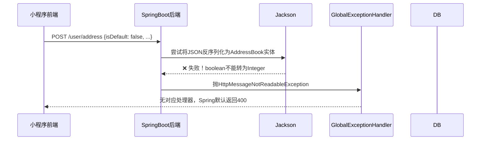

# 小程序地址保存 400 Bad Request 修复方案

## 问题现象

小程序前端在「新增地址」时调用 `POST /user/address` 接口，后端返回 HTTP 400 Bad Request：

```json
{
  "timestamp": 1781265310740,
  "status": 400,
  "error": "Bad Request",
  "path": "/user/address"
}
```

---

## 问题分析

### 完整请求链路



### 根因：类型不匹配

**前端**（[`my-vue3-project/src/pages/address/index.vue`](../my-vue3-project/src/pages/address/index.vue:139)）发送的 payload 中：

```javascript
const form = ref({
  consignee: "",
  phone: "",
  detail: "",
  isDefault: false,   // ← JSON boolean 类型！
})
```

最终发送的 JSON：
```json
{
  "consignee": "张三",
  "phone": "13800138000",
  "detail": "某某街道",
  "isDefault": false,
  "provinceName": "",
  "cityName": "",
  "districtName": ""
}
```

**后端**（[`AddressBook.java`](../hanye-take-out-springboot3/pojo/src/main/java/fun/cyhgraph/entity/AddressBook.java:33)）实体字段：

```java
private Integer isDefault;  // ← Java Integer 类型！
```

**Jackson** 在反序列化 JSON 时，**默认不允许**将 boolean（`false`）自动转换为 `Integer`，会抛出：

```
com.fasterxml.jackson.databind.exc.MismatchedInputException: 
Cannot deserialize value of type `java.lang.Integer` from Boolean value
```

该异常被 Spring Boot 默认错误处理拦截，返回 **400 Bad Request**，且后端现有的 [`GlobalExceptionHandler`](../hanye-take-out-springboot3/server/src/main/java/fun/cyhgraph/handler/GlobalExceptionHandler.java) 没有注册 `HttpMessageNotReadableException` 的处理器，所以无法捕获并返回友好的错误信息。

### 关键证据

| 检查项 | 结果 |
|--------|------|
| 后端 `@Insert` SQL 含 `is_default` 字段 | ✅ 是，所有地址必填字段均配置 |
| 后端 Service 设置 `setIsDefault(0)` 覆盖前端值 | ✅ 是，前端传的值会被覆盖 |
| Jackson 是否有 boolean→Integer 转换配置 | ❌ 否，[`JacksonObjectMapper`](../hanye-take-out-springboot3/common/src/main/java/fun/cyhgraph/json/JacksonObjectMapper.java) 只配了时间格式 |
| 后端是否处理 `HttpMessageNotReadableException` | ❌ 否，异常处理器未覆盖 |
| 数据库 `is_default` 字段约束 | `tinyint(1) not null default '0'`，需整型值 |

---

## 修复方案

### 方案一：✅ 推荐（前端 + 后端双向加固）

#### 1. 前端修复

将表单 `isDefault` 的初始值从 `false`（boolean）改为 `0`（number），保持与后端 Integer 类型一致。

**涉及文件：** [`my-vue3-project/src/pages/address/index.vue`](../my-vue3-project/src/pages/address/index.vue:139)

```diff
 const form = ref({
   consignee: "",
   phone: "",
   detail: "",
-  isDefault: false,
+  isDefault: 0,
 })
```

> **说明：** 后端 [`AddressBookServiceImpl.addAddress()`](../hanye-take-out-springboot3/server/src/main/java/fun/cyhgraph/service/serviceImpl/AddressBookServiceImpl.java:25) 中已执行 `addressBook.setIsDefault(0)`，所以前端传 0 即可，即使传了也会被后端覆盖。

#### 2. 后端修复（异常处理加固）

在 [`GlobalExceptionHandler`](../hanye-take-out-springboot3/server/src/main/java/fun/cyhgraph/handler/GlobalExceptionHandler.java) 中添加 `HttpMessageNotReadableException` 的处理器，避免再次出现类似反序列化问题时返回不友好的原始 400 错误。

```java
@ExceptionHandler
public Result exceptionHandler(HttpMessageNotReadableException ex){
    log.error("请求参数解析失败：{}", ex.getMessage());
    return Result.error("请求参数格式错误");
}
```

---

## 影响范围

| 模块 | 文件 | 变更类型 | 影响 |
|------|------|----------|------|
| 小程序前端 | [`address/index.vue`](../my-vue3-project/src/pages/address/index.vue:139) | 修改 | 仅改动 `isDefault` 初始值，不影响业务逻辑 |
| SpringBoot后端 | [`GlobalExceptionHandler.java`](../hanye-take-out-springboot3/server/src/main/java/fun/cyhgraph/handler/GlobalExceptionHandler.java) | 新增 | 添加新异常处理器，不影响现有逻辑 |

---

## 验证方法

1. 打开小程序，进入「地址管理」页
2. 点击「新增地址」，填写收件人、手机号、详细地址
3. 点击「保存地址」
4. 预期结果：**地址添加成功**，列表刷新显示新地址
5. 返回状态码应为 `200`，响应体为 `{"code": 0}`
